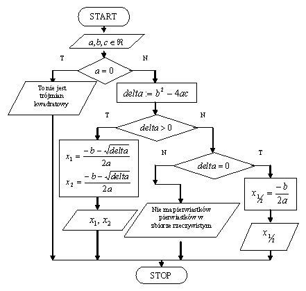

#  PROGRAM OBLICZAJĄCY PIERWIASTKI RÓWNANIA KWADRATOWEGO 

## Program pozwalający obliczenie pierwstków równania kwadratowego
### Technologia

Projekt został stworzony w:

* Visual studio

Język programowania:

* C#

# Schemat algorytmu obliczającego pierwiastki

